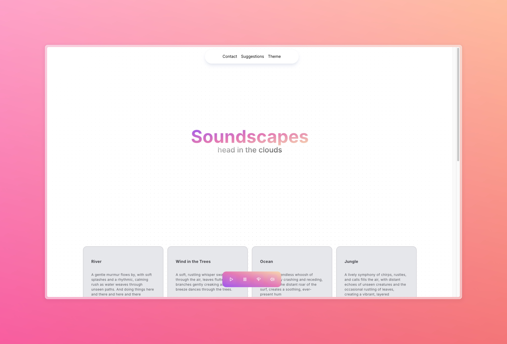
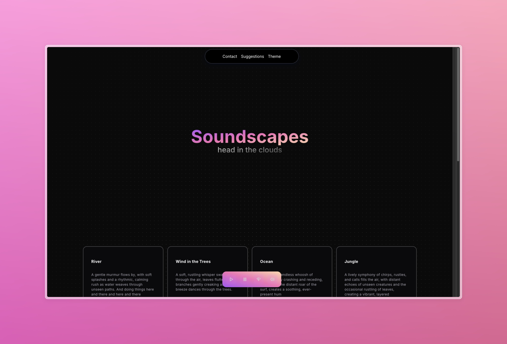
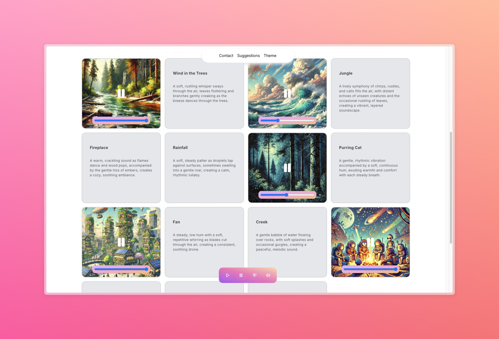
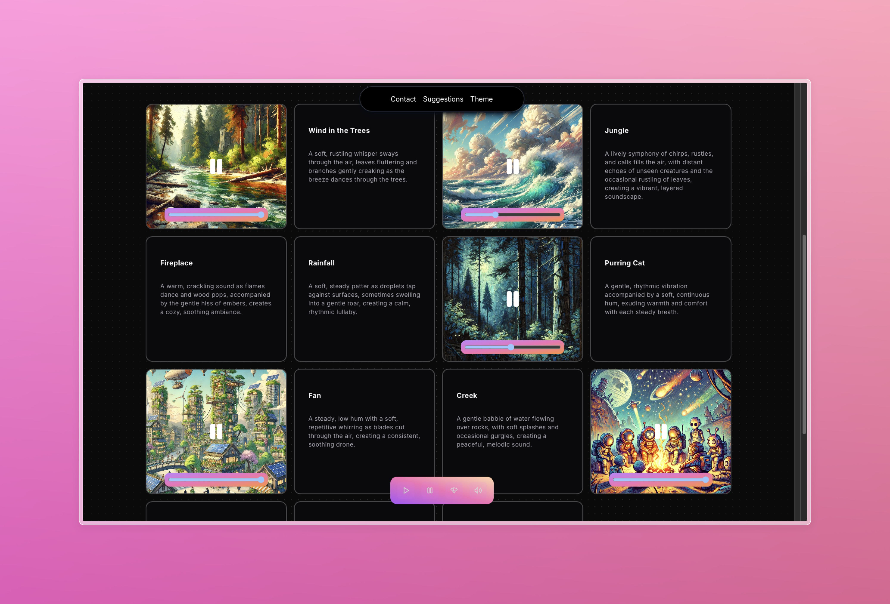

# Soundscapes

You ever try background playing background noise while you work? I'm sure you've found playlists for background tracks on YouTube or Spotify. But you can only pick one track at a time. What if you want to listen to ocean waves, and a bonfire crackling? What if you want to hear the ambience of a coffee shop but with the rain falling outside? 

"But there are apps for that!" you might say. And you might try to find a few apps that give you the ability to do this. But in a week, you get a notification that your trials has run out. You reach for your credit card in your wallet and you remember that you're too broke to have a credit card. You even skipped breakfast this morning to be able to afford rent. 

To you I say, welcome stranger. I give you, Soundscapes. 

Soundscapes is a web app that lets you create and listen to soundscapes. With much pain and suffering I put together a UI that looks pretty and is also very easy to use. It is also reactive and has a lot of animations that make people think it's more refined that it actually is. I built this with Next.js, TailwindCSS, [shadcn/ui](https://ui.shadcn.com/), and [Aceternity UI](https://ui.aceternity.com/).

## Getting Started

You want to run this app yourself? Great start! I applaud you, master of software, conqueror of code. Clone the repo, and run the following commands: 

```bash
cd app
npm install
```

Then, run the development server:

```bash
npm run dev
```

Open [http://localhost:3000](http://localhost:3000) with your browser to see the result.

## Deployment

Soundscapes is deployed on [Netlify](https://www.netlify.com/).

## UI










## Contributing

Want to contribute to the app I see? Glad to hear it. The more work you do, the less I have to do. Please feel free to use, clone, copy, or contribute to whatever you want. I honestly do not care.

